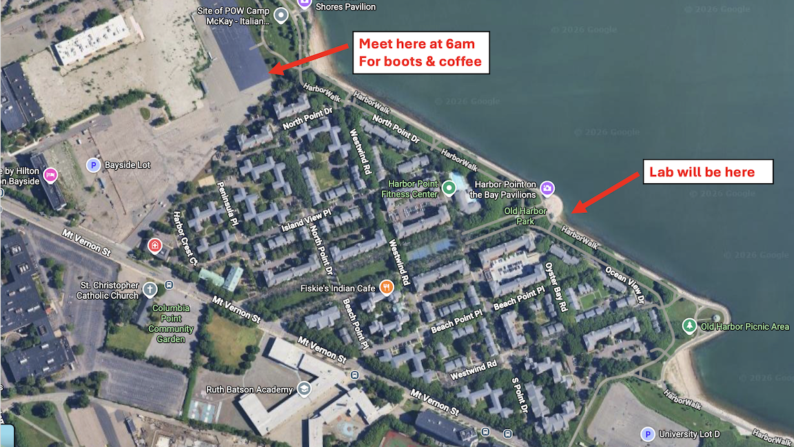

## 🗺️ When and Where
We will meet for lab not in our assigned space nor at our assigned time. But rather **MONDAY OCTOBER 28th AT 6AM AT THE BAYSIDE PARKING LOT**

Yes, we know this is early, but tide and time wait for no one! This will give us the jump on low tide and allow us to really dig into what is out in the field. Hey - could be worse! The weekend tides were even better, but also EARLIER!

## ⚓️ Introduction

Low tide exposes the lower reaches of the seashore to our exploration. We can begin to see the environment that organisms interact with and understand how organisms partition space. Today, we’ll look at the distribution of organisms in the intertidal.

## 🧪 Methods

1. Spend ~20 minutes exploring the area uncovered by the tides. Systematically explore the factors that appear to determine the abundance of *Littorina littorea* on rock surfaces and the abundance of *Hemigrapsus sanguineus* or other crabs on or under rocks. Ask us for species IDs beyond these four below.  

2. Based on your observations, construct a hypothesis about what regulates the abundances of crabs and snails.

3. Draw out how you think the system works using a box and arrow diagram. Think about things you have observed versus cannot. Think about what matters to the different organisms.  

4. Choose one organism to target to understand what influences its distribution. Choose one influence you are particularly interested in isolating. Come up with a clear hypothesis about the relationship between the species and the factor that influences its distribution.

5. Based on your hypothesis, diagram, and observations, create and draw out a sampling design to understand whether that influence regulates the distribution of your species of interest on the shore. Think about our principles of good sampling design – handling confounders, replication, etc. You make take additional measurements with tools provided, such as size of rocks, cover of algae, distance from the high-tide line, etc., if you think them warranted.  

6. Execute your sampling design after running it by us! We will have quadrats and transects for you to use for sampling. Then, that’s it for the day!

## 🦑 Species

There's a lot there! I would like you to target those above. For more, my lab is slowly putting together a [field guide](https://celp-lab.github.io/species_lists/rocky_intertidal.html) that we use for species IDs. But, really, ask us, and we'll tell you what you are looking at!

## 📒 Taking Data

Depending on your ‘design’ you should come up with a data recording system that looks something akin this (from the dock lab - this is a long format)

| Plot | Condition | Species   | Percent Cover  |   |   |   |   |   |   |
|------|-----------|-----------|----------------|---|---|---|---|---|---|
| 1    | Sunny     | Botryllus | 10             |   |   |   |   |   |   |
| 1    | Sunny     | Mussels   | 0              |   |   |   |   |   |   |
| 1    | Sunny     | Algae     | 80             |   |   |   |   |   |   |
| 1    | Sunny     | Bare      | 10             |   |   |   |   |   |   |
| 2    | Dark      | Botryllus | 40             |   |   |   |   |   |   |
| 2    | Dark      | Mussels   | 40             |   |   |   |   |   |   |

OR - perhaps you want do take data in a wide format.

| Plot | Condition | Botryllus_Cover   | Mussel_cover  | Algae_Cover  |   | Bare_cover  |   |   |   |
|------|-----------|-----------|----------------|---|---|---|---|---|---|
| 1    | Sunny     | 10 | 0             |  80 |  0 |   |   |   |   |
| 2    | Dark     | 40   | 40              | 20  | 0  |   |   |   |   |

Think about what will work best for you based on your question and data. You will need to enter your data into a spreadsheet after lab.

## 💻 Writeup Your Lab Report!

Please use Jamovi for all stats and graphs (or an alternate figure-making software, if you choose). We want to move writeups to a scientific-paper style. So, please provide:

1)	A brief introduction to what you observed. Discuss your hypothesis at length and proffer any alternatives. Provide a drawing of how you think the system works.  
  
2)	State the methods you used to conduct your study. Justify why, given your diagram, this is a good sampling design.  
  
3)	Provide a narrative discussion of results.  
  
4)	End with a conclusion regarding the weight of evidence for or against your hypothesis.

