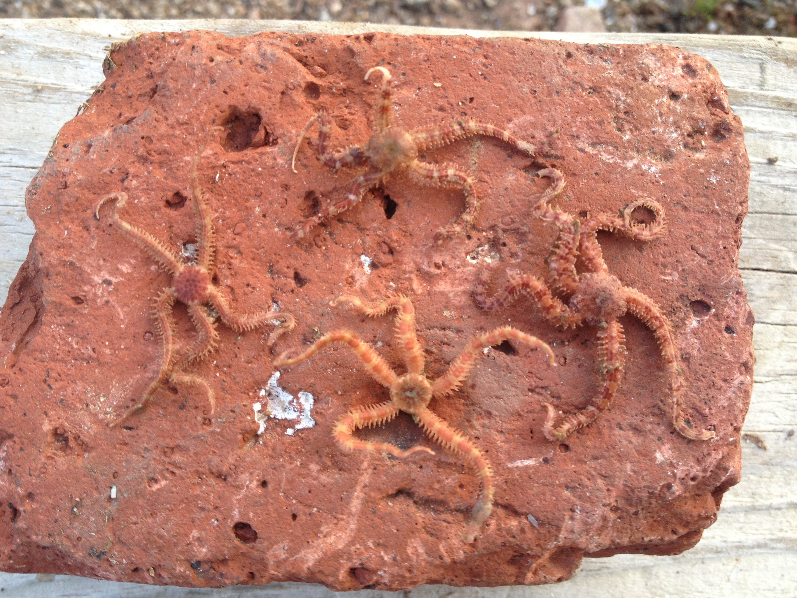

# 📑 Course Brief

**Focus:** This course explores the diversity of biological and ecological processes that shape life in the oceans. It places special emphasis on marine life in New England, focusing on the interactions between humans and the sea. This focus leads to a greater understanding of the consequences of ongoing environmental changes witnessed in the 20th and 21st centuries. 

**How:** Lectures, Paper Discussion, and Fieldwork for labs!

# 🎯 Learning Objectives

1. Understand how biological systems are structured and function within the world’s oceans.  
2. Learn how to understand new scientific information and rapidly incorporate it into one's knowledge of the goods and services produced by our oceans.
3. Gain an appreciation for how changes in the environment alter life in the sea and the concomitant indirect effects to human society.
4. Understand the historic, current, and future links between humans in New England and the ocean around us.

🌊 Additionally, for students in lab, we aim to have you:

1. Learn how experimental and observational data can and cannot be used to answer biological questions.
2. Learn how to conduct studies in coastal field environments.
3. Be able to conduct a small independent research project.
4. Be able to present results from a scientific study to colleagues.

-----------------

**Select Academic Year/Term:**

<a href="2026/index.qmd">
    <button class="button-61">Fall 2026</button>
</a>

